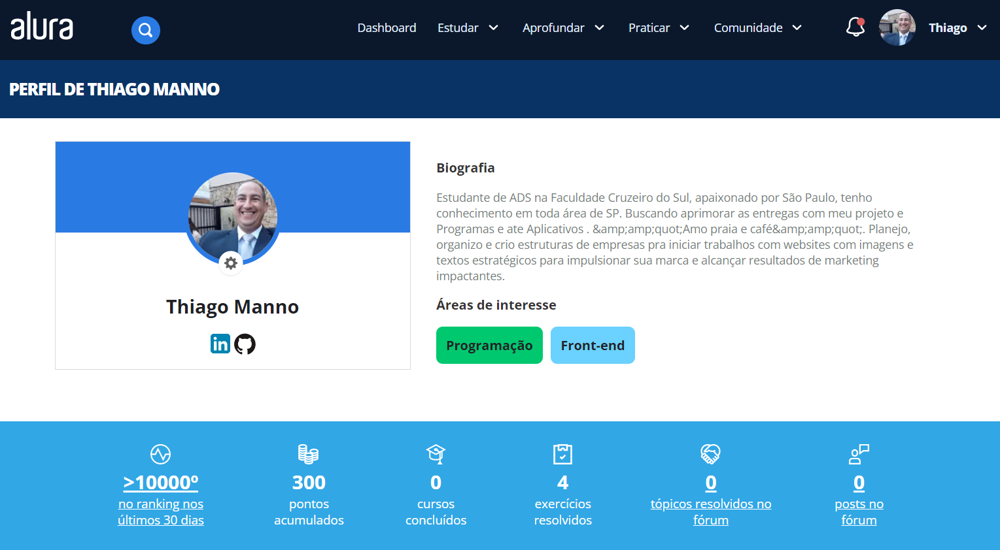

# Perfil de Desenvolvedor Iniciante

Olá! Sou Thiago Manno, um desenvolvedor iniciante com conhecimentos básicos em HTML, CSS e JavaScript. Atualmente, estou buscando oportunidades para desenvolver minhas habilidades e adquirir experiência prática em projetos reais.

## Formação

- Analise de Desenvolvimento de Sistemas - Universidade Cruzeiro do Sul (1° Semestre)
- Alura HTML e CSS: ambientes de desenvolvimento, estrutura de arquivos e tags

## Trabalhos em Andamento

- HTML Iniciante
- CSS Iniciante
- JavaScript Iniciante
- Exemplos:
 https://consultaseguros.com.br/ 
 https://www.belezacuidado2023.com.br 
 https://adegadovovo.com.br 
 https://amorcaca.vercel.app  

